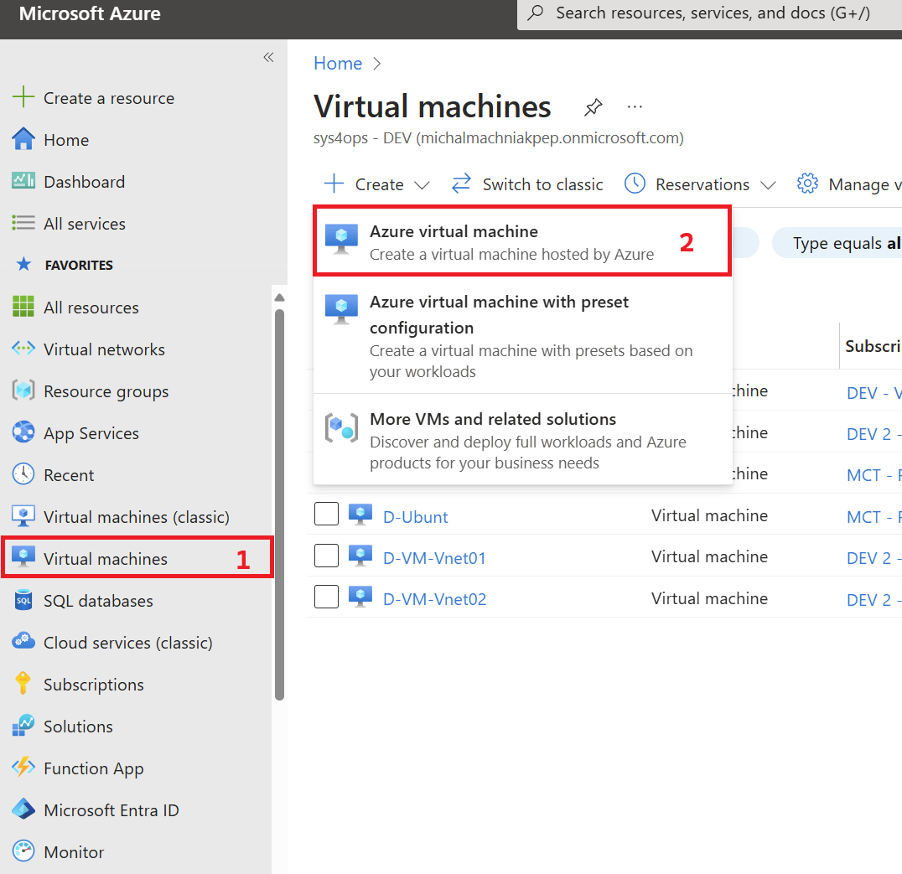
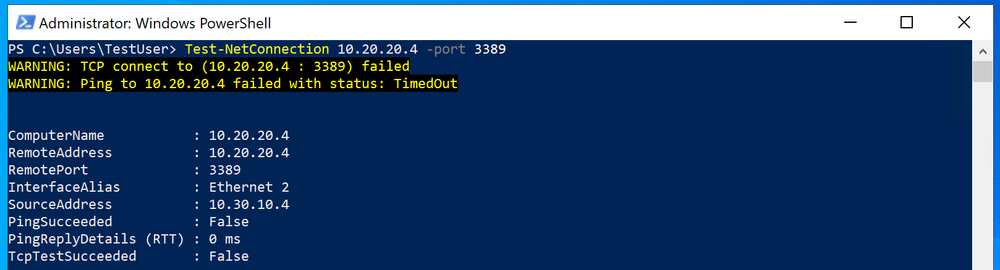

---
Exercise:
    title: 'M01 - Unit 8 Connect two Azure Virtual Networks using global virtual network peering'
    module: 'Module 01 - Introduction to Azure Virtual Networks'
---
# M01-Unit 8 Connect two Azure Virtual Networks using global virtual network peering

## Exercise scenario

In this unit, you will configure connectivity between the CoreServicesVnet and the ManufacturingVnet by adding peerings to allow traffic flow.


In this unit, you will:

+ Task 1: Create a Virtual Machines to test the configuration
+ Task 2: Connect to the Test VMs using RDP
+ Task 3: Test the connection between the VMs
+ Task 4: Create VNet peerings between CoreServicesVnet and ManufacturingVnet
+ Task 5: Test the connection between the VMs
+ Task 6: Clean up resources

**Note:** An **[interactive lab simulation](https://mslabs.cloudguides.com/guides/AZ-700%20Lab%20Simulation%20-%20Connect%20two%20Azure%20virtual%20networks%20using%20global%20virtual%20network%20peering)** is available that allows you to click through this lab at your own pace. You may find slight differences between the interactive simulation and the hosted lab, but the core concepts and ideas being demonstrated are the same.

### Estimated time: 20 minutes

## Task 1: Create a Virtual Machine to test the configuration

In this section, you will create a test VM on the Manufacturing VNet to test if you can access resources inside another Azure virtual network from your ManufacturingVnet.

### Create ManufacturingVM in ManufacturingVnet


1. Create Virtual Machnine


   ```powershell
   $RGName = "RG Created for Student with Number example 01"
   
   ```
1. Navigate to https://portal.azure.com
1. On navigation menu select **Virtual Machines**.
1. In context menu select **Create** --> **Azure Virtual Machnine**




1. Select subscription
1. Select resource group 
1. Enter **Virtual machine name**: ManufacturingVM${Studnet Number}
1. Select region setup to **West Europe**
1. Select **Avibility Zone** to **No infrastructure redudancy**
1. Select **Security Type** to **Standard**
1. Image **Windows Server 2022 Datacenter: Azure Edition -x64 Gen2**
1. Select size **Standard_B2ms**
1. Administrator account: **TestUser**
1. Enter administrator password
1. Public Inbound ports, select **RDP(3389)**
1. Click **Next: Disk**
1. Click **Next: Networking**
1. Select **Virtual Network**: ManufacturingVnet
1. Select **Subnet**: PublicWebServiceSubnet
1. **Public IP** select **create new** and enter name: ManufacturingVM${Studnet Number}-PIP
1. Click **Next: Review + Create**
1. When the deployment is complete, go to the Azure portal home page, and then select **Virtual Machines**.

### Create TestVM1${Studnet Number} and TestVM2${Studnet Number} in CoreServicesVnet

1. Create Virtual Machnine


   ```powershell
   $RGName = "RG Created for Student with Number example 01"
   
   ```
1. Navigate to https://portal.azure.com
1. On navigation menu select **Virtual Machines**.
1. In context menu select **Create** --> **Azure Virtual Machnine**


1. Select subscription
1. Select resource group 
1. Enter **Virtual machine name**: TestVM01${Studnet Number}
1. Select region setup to **East US**
1. Select **Avibility Zone** to **No infrastructure redudancy**
1. Select **Security Type** to **Standard**
1. Image **Windows Server 2022 Datacenter: Azure Edition -x64 Gen2**
1. Select size **Standard_B2ms**
1. Administrator account: **TestUser**
1. Enter administrator password
1. Public Inbound ports, select **RDP(3389)**
1. Click **Next: Disk**
1. Click **Next: Networking**
1. Select **Virtual Network**: CoreServicesVnet
1. Select **Subnet**: PublicWebServiceSubnet
1. **Public IP** select **create new** and enter name: TestVM01${Studnet Number}-PIP
1. Click **Next: Review + Create**
1. When the deployment is complete, go to the Azure portal home page, and then select **Virtual Machines**.


## Task 2: Connect to the Test VMs using RDP

1. On the Azure Portal home page, select **Virtual Machines**.

1. Select **ManufacturingVM${Studnet Number}**.

1. On ManufacturingVM${Studnet Number}, select **Connect &gt; RDP**.

1. On ManufacturingVM${Studnet Number} | Connect, select **Download RDP file**.

1. Save the RDP file to your desktop.

1. Connect to ManufacturingVM using the RDP file, and the username **TestUser** and the password you provided during deployment.

1. On the Azure Portal home page, select **Virtual Machines**.

1. Select **TestVM1${Studnet Number}**.

1. On TestVM1, select **Connect &gt; RDP**.

1. On TestVM1 | Connect, select **Download RDP file**.

1. Save the RDP file to your desktop.

1. Connect to TestVM1${Studnet Number} using the RDP file, and the username **TestUser** and the password you provided during deployment.

1. On both VMs, in **Choose privacy settings for your device**, select **Accept**.

1. On both VMs, in **Networks**, select **Yes**.

1. On TestVM${Studnet Number}1, open a PowerShell prompt, and run the following command: ipconfig

1. Note the IPv4 address.

## Task 3: Test the connection between the VMs

1. On the ManufacturingVM${Studnet Number}, open a PowerShell prompt.

1. Use the following command to verify that there is no connection to TestVM1${Studnet Number} on CoreServicesVnet. Be sure to use the IPv4 address for TestVM1${Studnet Number}.

   ```powershell
    Test-NetConnection 10.20.20.4 -port 3389
    ```

1. The test connection should fail, and you will see a result similar to the following:
   

## Task 4: Create VNet peerings between CoreServicesVnet and ManufacturingVnet

1. On the Azure home page, select **Virtual Networks**, and then select **CoreServicesVnet**.

1. In CoreServicesVnet, under **Settings**, select **Peerings**.
   

1. On CoreServicesVnet | Peerings, select **+ Add**.

1. Use the information in the following table to create the peering.

| **Section**                          | **Option**                                    | **Value**                             |
| ------------------------------------ | --------------------------------------------- | ------------------------------------- |
| This virtual network                 |                                               |                                       |
|                                      | Peering link name                             | CoreServicesVnet-to-ManufacturingVnet |
|                                      | Traffic to remote virtual network             | Allow (default)                       |
|                                      | Traffic forwarded from remote virtual network | Allow (default)                       |
|                                      | Virtual network gateway or Route Server       | None (default)                        |
| Remote virtual network               |                                               |                                       |
|                                      | Peering link name                             | ManufacturingVnet-to-CoreServicesVnet |
|                                      | Virtual network deployment model              | Resource manager                      |
|                                      | I know my resource ID                         | Not selected                          |
|                                      | Subscription                                  | Select the Subscription provided      |
|                                      | Virtual network                               | ManufacturingVnet                     |
|                                      | Traffic to remote virtual network             | Allow (default)                       |
|                                      | Traffic forwarded from remote virtual network | Allow (default)                       |
|                                      | Virtual network gateway or Route Server       | None (default)                        |
| Review your settings and select Add. |                                               |                                       |
|                                      |                                               |                                       |


1. In CoreServicesVnet | Peerings, verify that the **CoreServicesVnet-to-ManufacturingVnet** peering is listed.

1. Under Virtual networks, select **ManufacturingVnet**, and verify the **ManufacturingVnet-to-CoreServicesVnet** peering is listed.

## Task 5: Test the connection between the VMs

1. On the ManufacturingVM, open a PowerShell prompt.

1. Use the following command to verify that there is now a connection to TestVM1 on CoreServicesVnet.

   ```powershell
    Test-NetConnection 10.20.20.4 -port 3389
    ```

1. The test connection should succeed, and you will see a result similar to the following:
   

Congratulations! You have successful configured connectivity between VNets by adding peerings.
