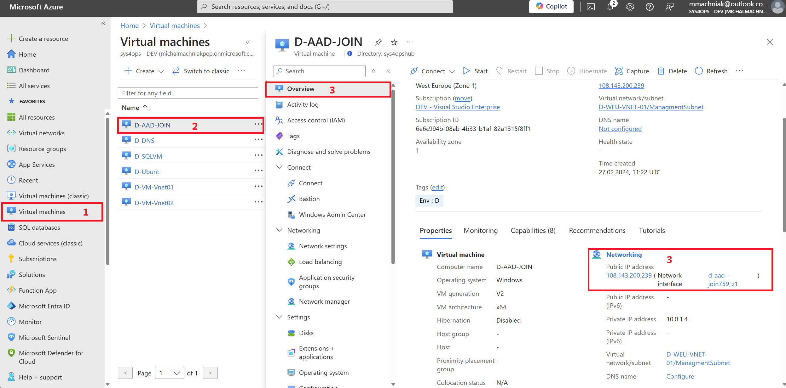
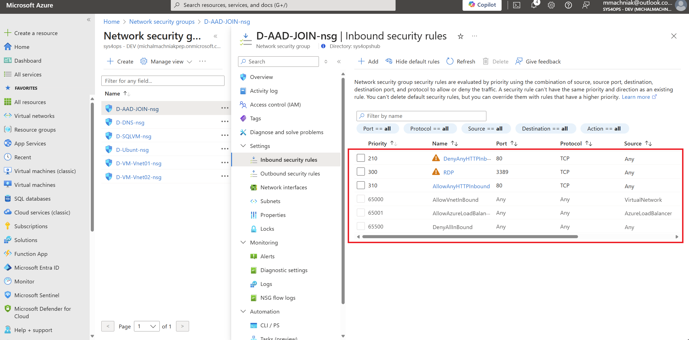
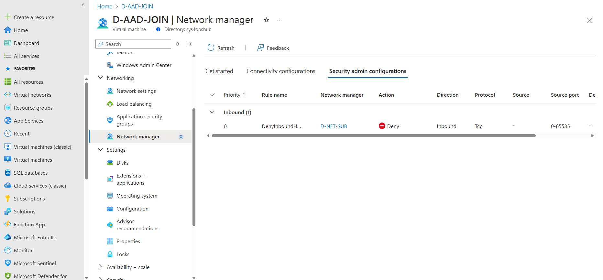

---
Exercise:
    title: 'Network security group'
---
# LAB03 Network Security Groups and Network Manager

## Exercise scenario

In this unit, you will configure connectivity Network security Group Rules for CoreServicesVnet and Virtual Machines. 


In this unit, you will:

+ Task 1: Install IIS services on Virtual Machines
+ Task 2: Configure Network Security Rules for Virtual Machnine
+ Task 3: Create and configure Network Security Rules for Subnet
+ Task 4: Create and configure Network Manager with Connection Rules

### Estimated time: 20 minutes

## Task 1: Install IIS services

1. Select **TestVM1${Studnet Number}** and **TestVM2${Studnet Number}**..

1. On TestVM1, select **Connect &gt; RDP**.

1. On TestVM1 | Connect, select **Download RDP file**.

1. Save the RDP file to your desktop.

1. Connect to TestVM1${Studnet Number} using the RDP file, and the username **TestUser** and the password you provided during deployment.

1. On both VMs, in **Choose privacy settings for your device**, select **Accept**.

1. On both VMs, in **Networks**, select **Yes**.

1. On TestVM1${Studnet Number}, open a PowerShell prompt, and run the following command: 

```powershell

Install-WindowsFeature -name Web-Server -IncludeManagementTools

```
## Task 2: Configure Network Security Rules for Virtual Machnine

1. In https://portal.azure.com naviagte to **Virtual Machnines**
1. Select **TestVM1${Studnet Number}** and **TestVM2${Studnet Number}**
1. In options check **Public IP adress** of Virtul Machnine **TestVM1${Studnet Number}** and **TestVM2${Studnet Number}**



1. Open web browser and type http://{public address} and check that access faild
1. Select **Virtual Machnine**: **TestVM1${Studnet Number}** and **TestVM2${Studnet Number}**
1. On navigation menu select **Networking Settings** and extend **Create port rule** and select **Inbound port rule**
1. Source select: **Any**
1. Source port range: *
1. Service select: **HTTP**
1. Action: **Allow**
1. Click: **Add** 
> **Note:** Applying security rule can take few minutes
1. Open web browser and type http://{public address} and check that access is granted.

## Task 3: Create and configure Network Security Rules for Subnet

1. In https://portal.azure.com type **Network Security Group**
1. On navigation menu click **Create**
1. Select subscription
1. Select resource group 
1. Enter Name: 
1. Select region: **East US**
1. Click **Review + Create**
1. In https://portal.azure.com type **Virtual networks**
1. Select: CoreServicesVnet-PublicWebSite${{Studnet Number}}
1. Navigate to **Subnets**
1. Select: **PublicWebServiceSubnet**
1. In the **Security** go to **Network security group** and select created: CoreServicesVnet-PublicWebSite${{Studnet Number}}
1. Click **Save**
1. In https://portal.azure.com type **Network Security Group**
1. Select: CoreServicesVnet-PublicWebSite${{Studnet Number}}
1. Select **Inbound security rule**
1. Click: **Add**
1. Source select: **Any**
1. Source port range: *
1. Service select: **HTTP**
1. Action: **Deny**
1. Priority: Setup higher then added for Virtual Machine example: 210
1. Click: **Add**
> **Note:** Applying security rule can take few minutes 
1. Open web browser and type http://{public address} and check that access is denied.
1. Remove: Network Security Rule: CoreServicesVnet-PublicWebSite${{Studnet Number}}

‎


## Task 4: Create and configure Network Manager with Connection Rules

1. In search bar typ **Network managers**
1. On contex menu click **Create**
1. Select subscription
1. Select resource group 
1. Enter Name: **NetManager${{Studnet Number}}**
1. Select region: **East US**
1. Features: **Security Admin**
1. When deploymnt finished enter to Network Manager
1. In navigation menu go to **Network Groups**
1. Click **Create**
1. Name: VnetEstUS
1. Member Type: **Virtual Network** and **Create**
1. In navigation menu go to **Configuration**
1. **Create** and select **Security Admin Configuration**
1. Name: **BlockHTTP** go **Next**
1. Deployment option: **None**
1. Network group address space aggregation option: **None** go **Next: Rule Collections**
1. Add rule collection, 
1. Name: **DenyInboundHttp**
1. Target network groups: **VnetEstUS**
1. Add rule: **DenyInboundHttp**
1. Priority: 101
1. Action: **Deny**
1. Direction: **Inbound**
1. Protocol: TCP
1. Source select: **Any**
1. Source port range: *
1. Destination  select: **Any**
1. Destination  port range: **80**
1. **Add** and **Add** and **Review and Create** and **Create and start deployment**
1. Target Region: **East US**
1. Deploy

> ‎**Note:** Applying security rule can take few minutes 

1. Navigate to any Virtual Machnine
1. In naviagation go to **Network Manager** and check that rules are applied
1. Remove **Network Manager**




 


